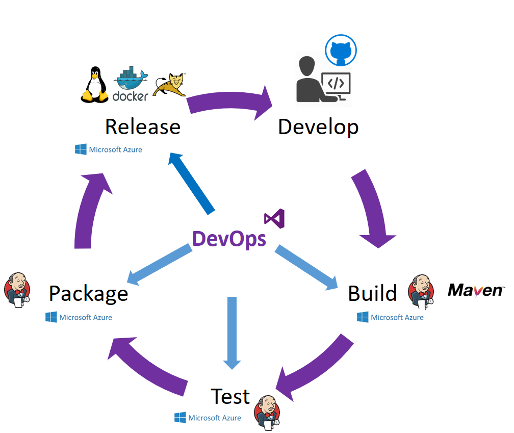
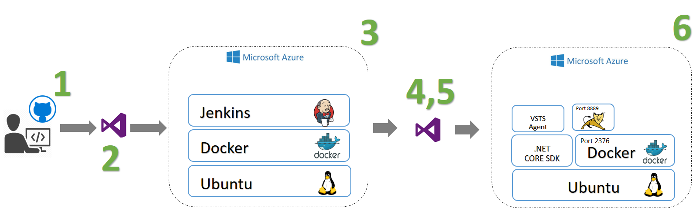

# HOL Introduction

This Hands-on-lab is an example of continuous build and deployment of containerized Java Web applications using Linux, Docker, 
Jenkins, VSTS and Maven on Azure.

 

Today everyone is looking for try/learn/automate/experiment in the simplest way possible how to deploy in a cloud architecture; this is a classic DevOps scenario and here you will find an intent to show a Devops lifecycle from scratch.

If you are looking for more information about each tool [check it here](https://xebialabs.com/the-ultimate-devops-tool-chest/).

## Architecture

In architecture's terms we will use:

1. Jenkins Continuous Integration and Delivery server on Azure. This Deployment results in the following offerings being installed:

   * Ubuntu 16.04.0-LTS (amd64 20160627) Virtual Machine by Canonical, Inc.

   * Docker Engine VM Extension by Microsoft Corporation.

   * The Jenkins container as published by Docker, Inc. in the [Docker Hub official repository](https://hub.docker.com/)
2. Ubuntu Server 14.04.5 LTS amd64 20161020 Public Azure, 20160830 Blackforest, 20161020 Azure China, 20160919 GovCloud

   * Microsoft Docker extension. This extension will install a Docker daemon on the virtual machine.

3. VSTS 

## Steps

Follow all the HOL labs.

## Result

As expected result you will get the workflow depicted below

1. Using for example Eclipse IDE a developer creates/updates a Java Web Application
2. VSTS detects a commit on GitHub repository and triggering a new build
3. Jenkins starts a maven build and publish the war file created
4. VSTS uploads the war file to an Ubuntu directory
5. VSTS connets to Docker Hub and pull a Tomcat container to deploy it in Ubuntu machine. VSTS runs a docker command to deploy the war file in Tomcat container
6. The Java Web application is deployed in Tomcat and accessible through a browser
