# 2. Creating and configuring a Jenkins server in Azure

## 2.1 Overview
In this lab, we will use Jenkins to create a build using maven to use it in our HOL-OSS-DEVOPS project.

### 2.1.1 Objectives
This lab aims to get you familiar with Jenkins on Azure Cloud.

### 2.1.2 Requerimients
You must have the Azure account mentioned in Lab 01.

## 2.2 Creating a VM in Azure running Jenkins

1. Browse to Azure Portal

   You can use all the Jenkins templates showed below; for this lab we will use Jenkis template published by Docker. This will setp up an Ubuntu VM with the Docker engine installed and a Jenkins container running on it. 
   

2. Click Create to begin the creation of the VM. 


3. Fill in the basic machine settings:

    **Name:** OSSDevOpsHOL  
    **VM Disk Type:** HDD  
    **Username:** ossdevopshol-user  
    **Authentication type:** Password  
    **Password:** Choose a password you will remember  
    **Subscription:** Your Azure subscription  
    **Resource group:** (Create new) OSSDevOpsHOL  
    **Location:** Your preferred location


4. Select the "A0 Basic" virtual machine size. If you are unable to see this machine size, make sure you are viewing "All" machine sizes and not only those that are "Recommended" (you can toggle this view in the upper right corner of the machine size viewer).
 

5. In the third step you can select optional extensions to be installed, but we will simply leave this as-is and select OK to move to the next step.
   

6. Validate the configuration settings you've selected and click OK. 


7. The machine will now be deployed for you: 
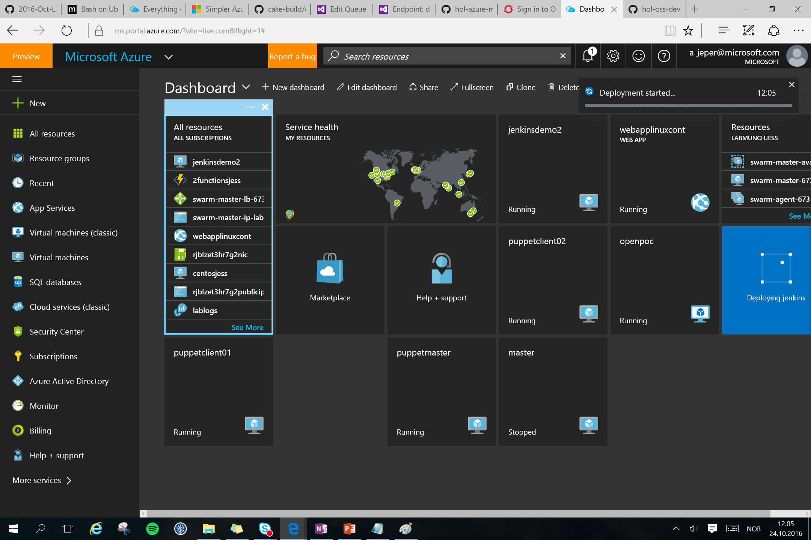

## 2.3 Unlock Jenkins

1. When the VM has been deployed, select the machine to open the overview window as shown below.


2. Take note of the "Public IP address" of your machine, you will need this in the next step to access jenkins

3. Go to http://{your-public-ip}:8080 to access Jenkins

4. When you log in to Jenkins for the first time, it will ask you to unlock it. To unlock, we will connect directly to the machine that Jenkins in installed on and retrieve the password.
   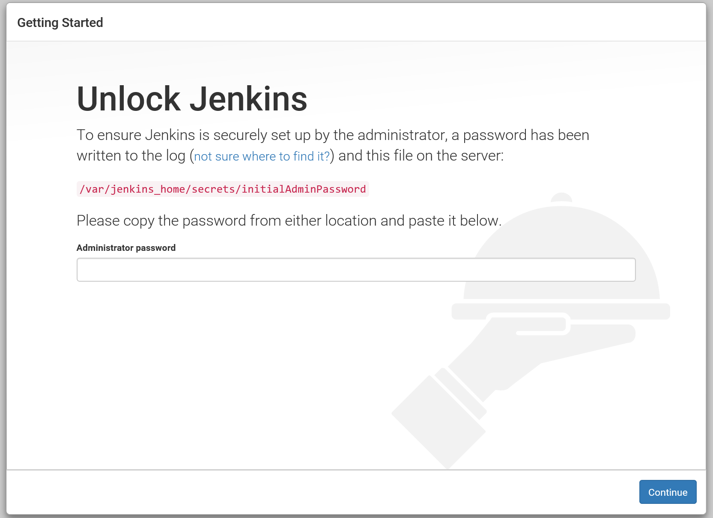

5. If you don't have PuTTY already, [download the PuTTY client here](http://www.putty.org/).

6. Run the PuTTY.exe file to start the client. 

7. Enter the public IP address from step 2 into the "Host name (or IP address) textbox" and click "Open" to connect to the machine. 
   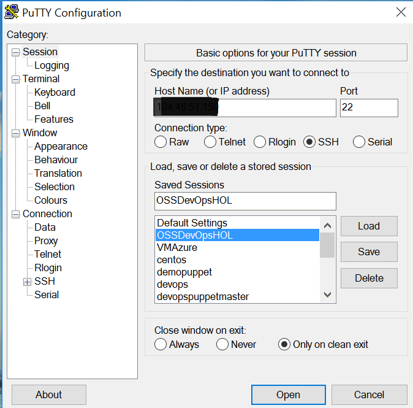

8. When you receive a PuTTY Security Alert, click "Yes"
   
   
9. When asked, type in the username and password you specified when you created the virtual machine in section 2.2 of this lab. 
   

   

   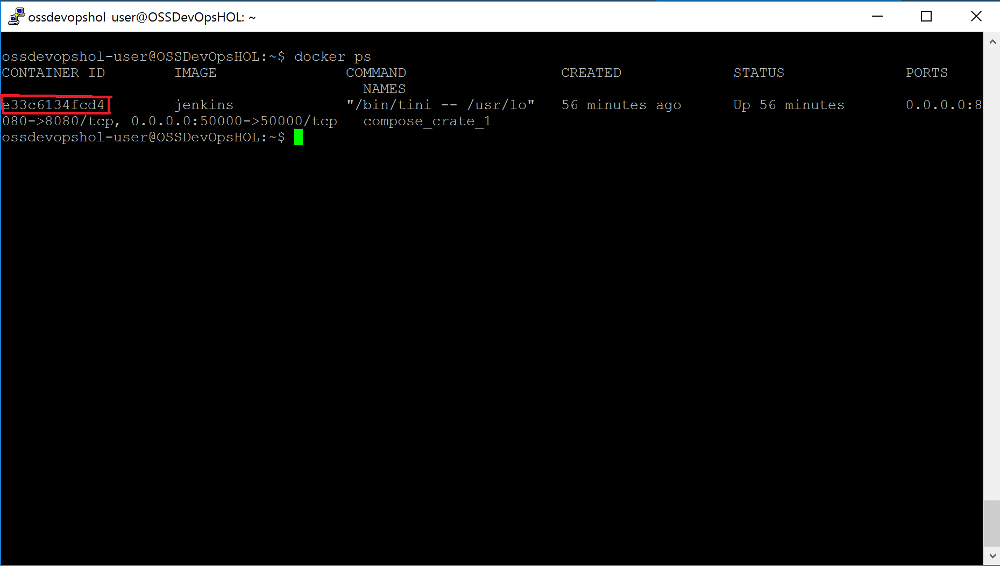

10. In order to access the Administrators password used to unlock Jenkins, we need to access the Docker container in which Jenkins is installed. List all containers by running the following command:

    ```
    docker ps
    ``` 

11. Now that we have the container ID of the Jenkins container, we can access its logs by running the following command: 

    ```
    docker logs {containerID}
    ``` 

12. You will now see the Administrators password required to unlock Jenkins: 
      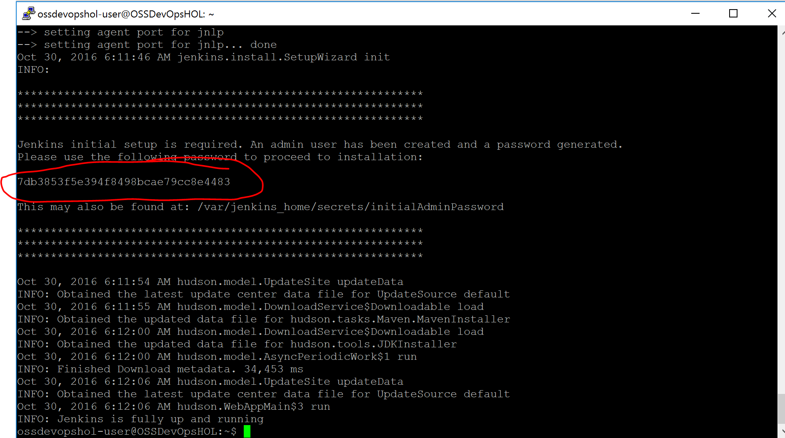

13. Provide the Administratior password and continue to the next step.
  

14. Select "Install suggested plugins" and wait for the installation to complete.
      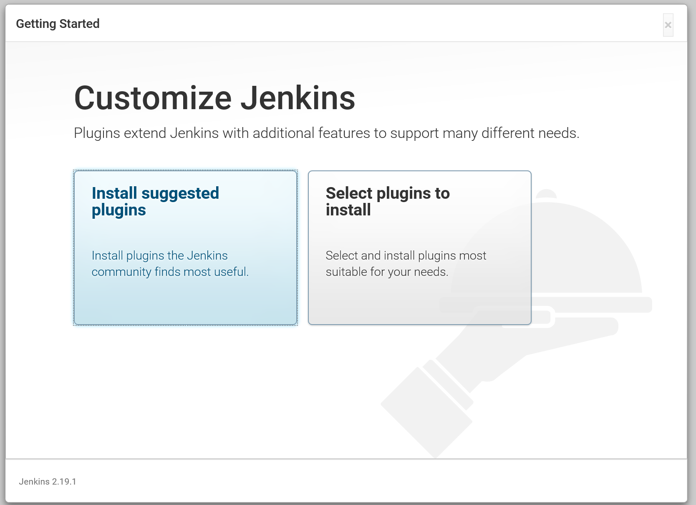
      

15. Create a new admin user in Jenkins by filling out the following fields and clicking "Save and Finish"
   

16. Once you have created a new user, Jenkins is ready! Click "Start using Jenkins" to proceed.
   

## 2.4 Configuring a Maven build in Jenkins

### 2.4.1 Install maven plugins
   
1. To create our build we will need install the maven plugins. Browse to Manage Jenkins-> Manage Plugins
   

2. Select the "Available" tab to view all available plugins and mark the "Maven Integration Plugin" for download. Click "Install without restart" to install the plugin.
     


### 2.4.2 Maven Configuration

1. Go to the Jenkins Dashboard and select "Manage Jenkins"


2. Click on "Global Tool Configuration"
    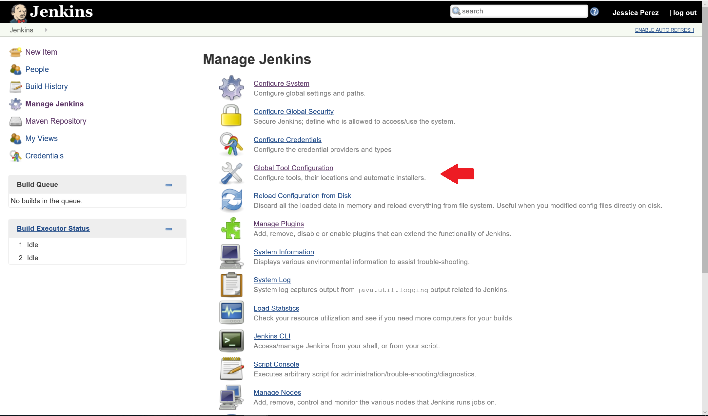

3. Scroll down to the "Maven" section and click on the "Add Maven" button.
    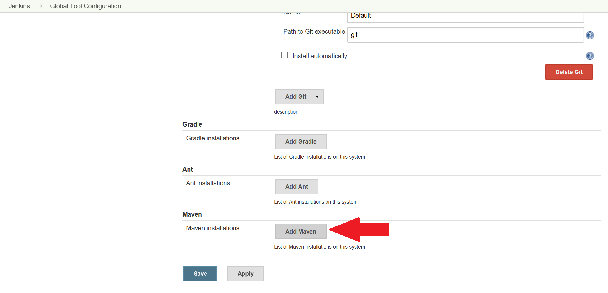

4. Specify the name "maven" and ensure that the "Install automatically" checkbox is marked.
    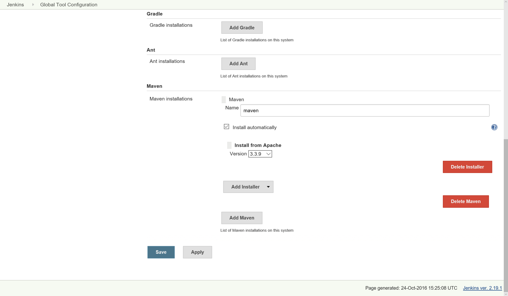

5. Click "Save".

6.  After configuring the Maven installation you need to configure the Maven Option Variables. Click on "Configure System".
     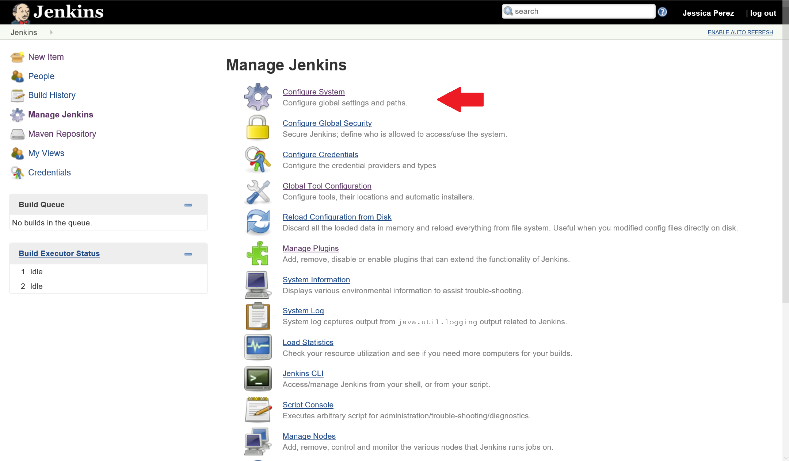

7. Scroll down to the "Maven Project Configuration" section and click the arrow to the right of the textbox to expand to multiple lines.
    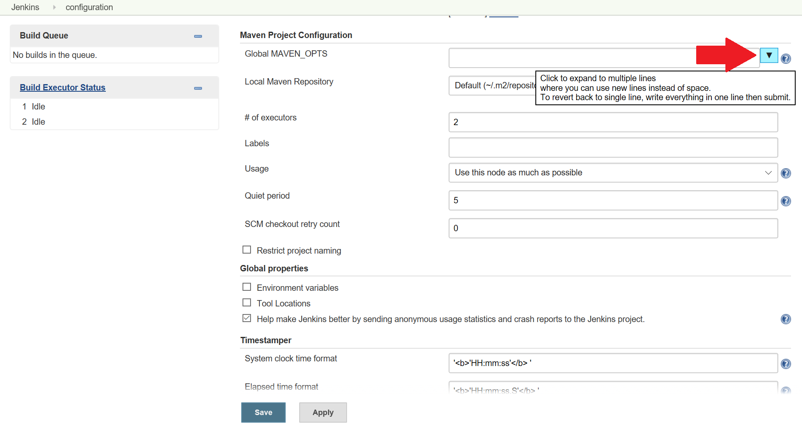

8. Specify the following values for "Global MAVEN_OPTS":
    ```
      -Xmx512m
      -XX:MaxPermSize=128m
      -Pupstream
    ``` 
    

9. Click "Save".

### 2.4.3 Create a Maven build
1. Go back to the Jenkins Dashboard and click on "New Item".
      

2. Create a "Freestyle project" with the name "MavenBuid" and click "OK" to continue.
      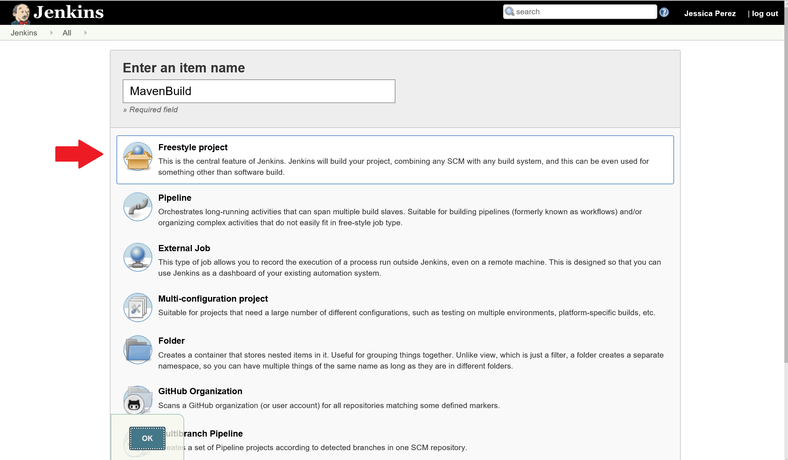

3. Click on the "Build" tab of the configuration. In the "Add build step" dropdown, select "Invoke top-level Maven targets".
      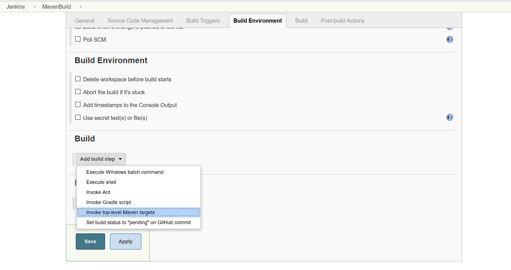

4. Click on the arrow next to the "Goals" textbox to expand the textbox to multiple lines. 
 

5. Select the "Maven Version" we set up previously and specify the following goals for the build and click on the "Advanced..." button:
    ```
    clean
    package
    ``` 
      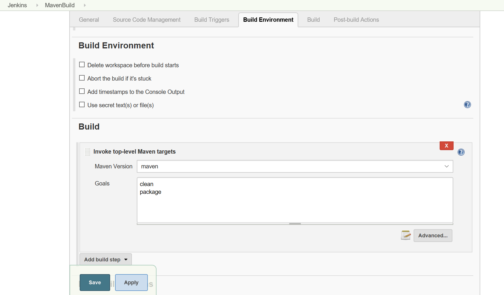

6. Add the following "POM" file path to the configuration:
    ```
    sample-app/pom.xml
    ``` 
    

7. Click on the "Post-build Actions" tab and add a post-build action of type "Archive the artifact" where you archive the files matching the following pattern:
      ```
    **/target/*.war
    ``` 
    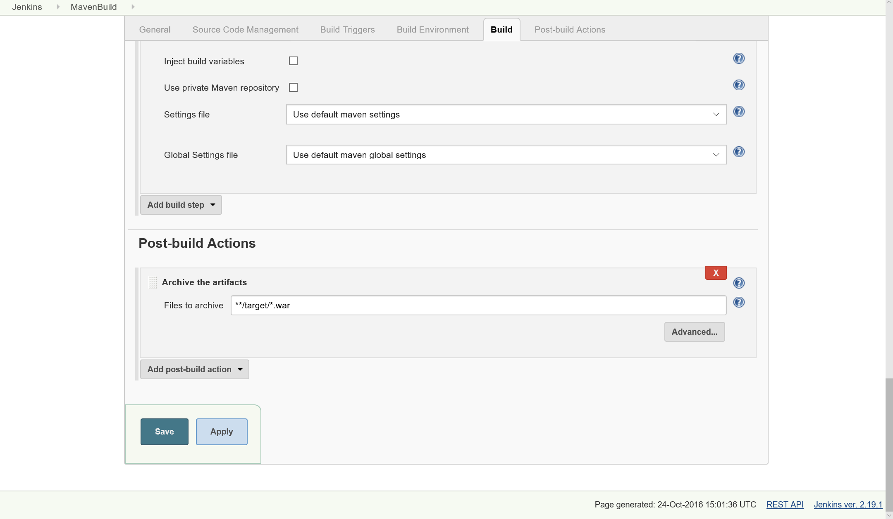

8. Click on "Save".

