# 3. Setting up an automated build in Visual Studio Team Services
## 3.1. Overview
In this lab, we will retrieve our sample Java application from GitHub and trigger a Jenkins build from Visual Studio Team Services (VSTS). Jenkins will build our application using Maven and package it, before VSTS retrieves the package and stores it as an artifact.

### 3.1.1 Objectives
This lab aims to get you familiar with how Visual Studio Team Services can retrieve code from a GitHub repository and you can integrate with Jenkins to build and package an application. 

### 3.1.2 Requirements
You must have completed Lab 01 and Lab 02.

## 3.2. Setting up VSTS
In this session, we will create a GitHub service endpoint that enables us to retrieve the code in a GitHub repository. We will also create a Jenkins service endpoint to enable a connection to Jenkins. Our intention is for Jenkins to build and package the application, VSTS simply queues the Jenkins build and retrieves the package when Jenkins is finished packaging it.

### 3.2.1 Creating a VSTS project

1. Go to your VSTS account (replace your-account-name in the following URL): https://**{your-account-name}**.visualstudio.com/    

2. Click "New" to create a new Team project, and specify following information. 

    **Name:** OSSDevOpsHOL
    
    **Description:** Introduction to open source DevOps practices in the cloud. Hands on labs to show how Visual Studio Team Services integrates with GitHub, Jenkins and Docker. 

    **Process template:** Agile

    **Version control:** Git (It doesn't really matter what you select here as we will retrieve our code from GitHub)
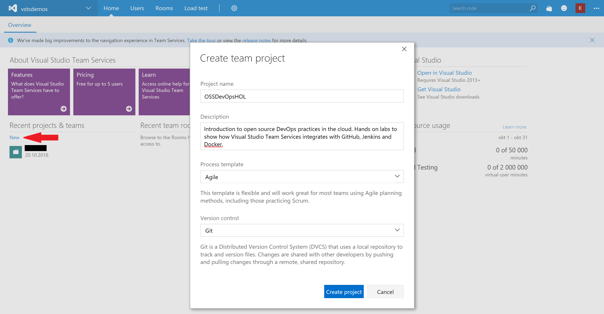

3. Click "Create project"

4. Click "Navigate to project"
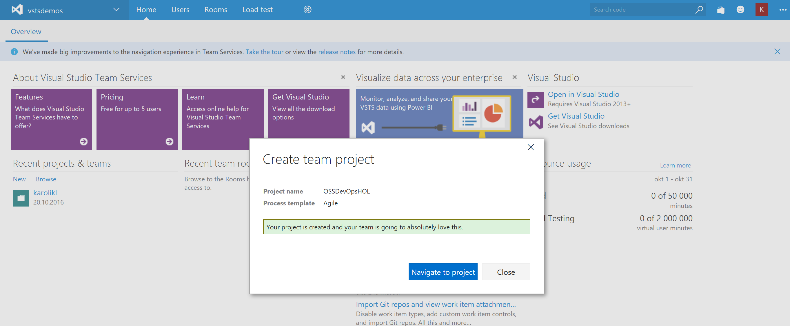

### 3.2.2 Connecting VSTS to GitHub

We will now create a new service connection to GitHub so that VSTS will have access to our GitHub repository later on in this lab.

1. Navigate to "Services" under "Settings"
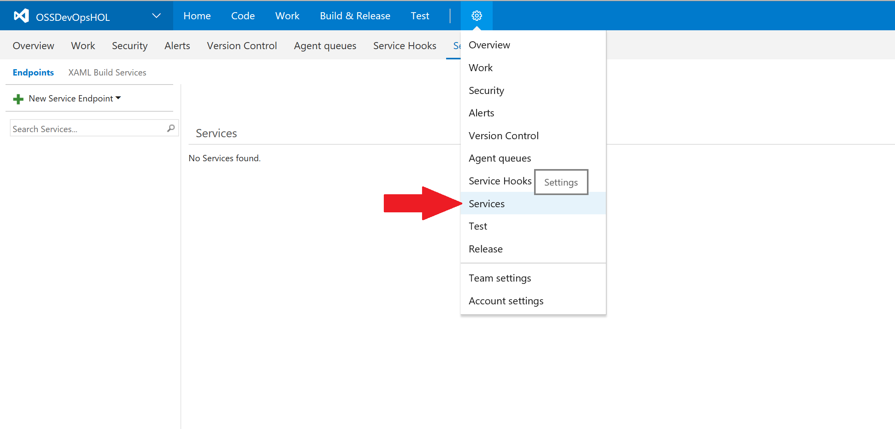

2. Create a new GitHub connection by clicking on "+ New Service Endpoint" and selecting "GitHub"
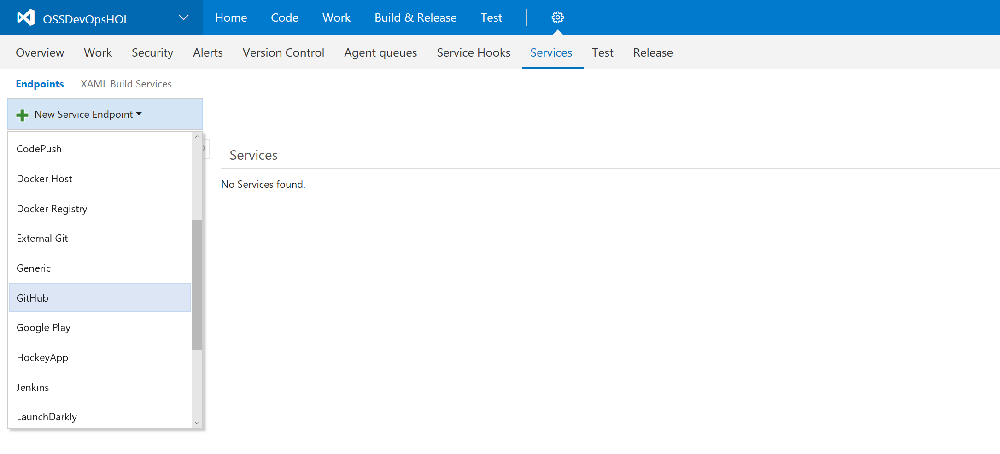

3. Click on the "Authorize" button and follow the steps required by GitHub to authorize access to your account.
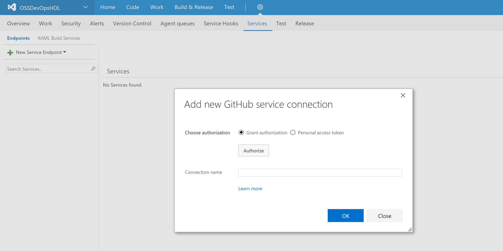

4. When access is granted, you will see a message that confirms the connection and you can specify a connection name. Click OK.
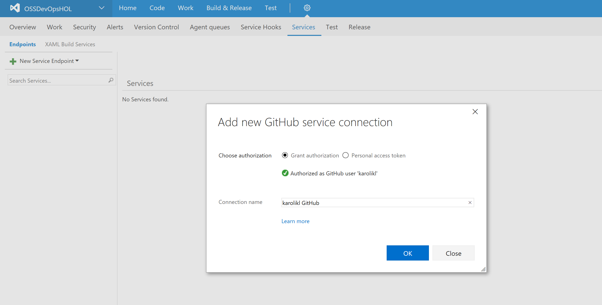

5. You should now see the service endpoint you just created in the overview:
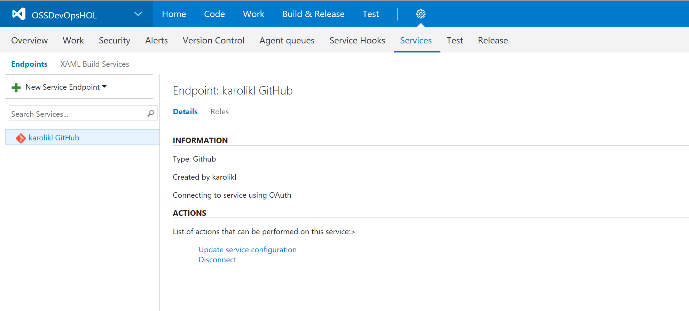

### 3.2.3 Connecting VSTS to Jenkins

We will now create a new service connection to Jenkins so that VSTS will have access to the Jenkins server created in the previous lab.

2. Create a new Jenkins connection by clicking on "+ New Service Endpoint" and selecting "Jenkins"
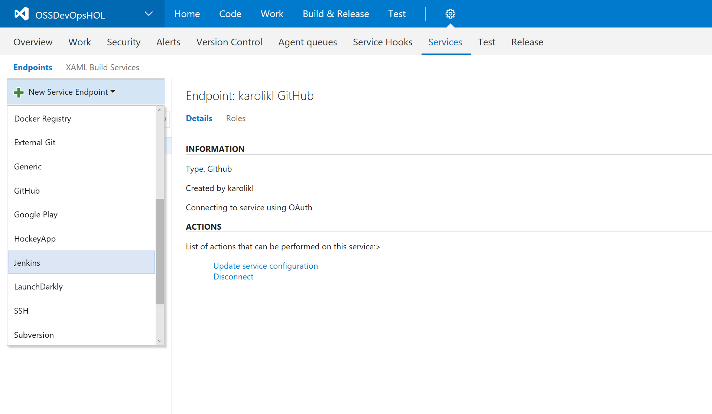 

3. Specify a connection name and the Server URL, Username and Password of your Jenkins server (this was set in Lab 2.2.1)
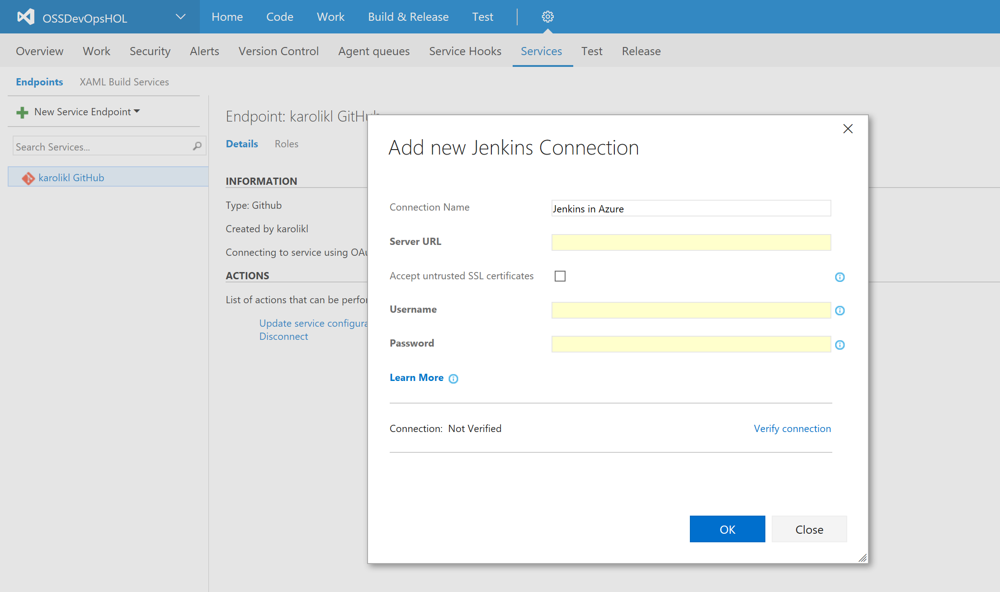

4. Click "Verify connection" to ensure that VSTS is able to connect to the Jenkins server.

5. When the connection is verified, you will see a message that confirms the connection and you can click OK.
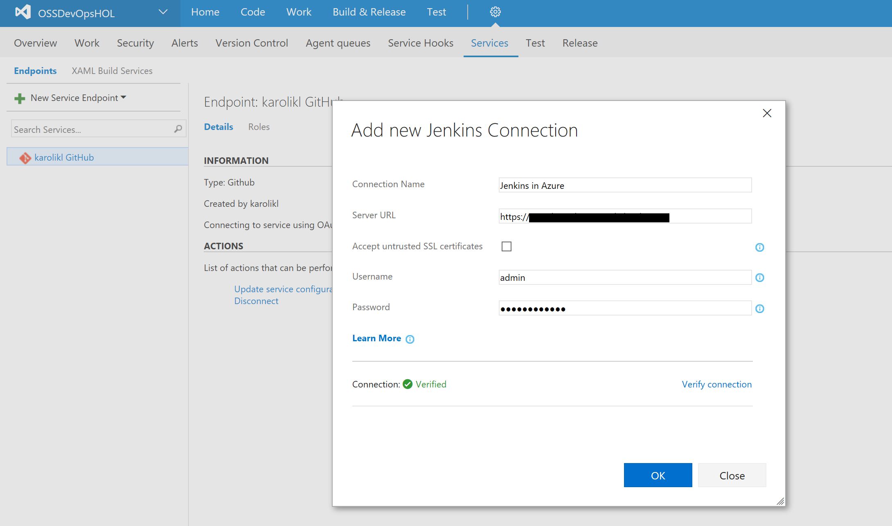

6. You should now see the service endpoint you just created in the overview:
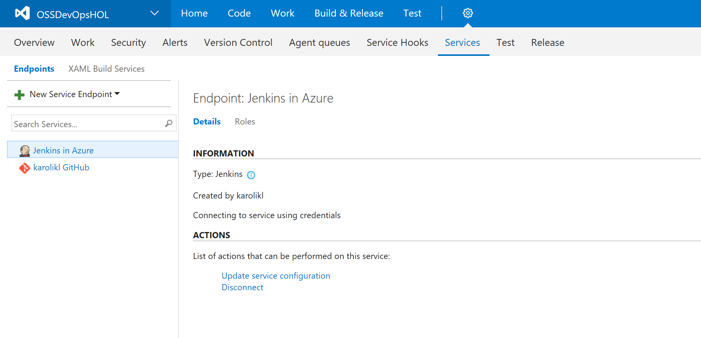

## 3.3. Building the application using VSTS

### 3.3.1 Creating a build definition

We will now create a new *Build Definition* that contains all the steps to be executed when we trigger a build. We will enable [*Continous Integration*](https://en.wikipedia.org/wiki/Continuous_integration) so that a build is triggered every time you push code to the GitHub repository.

1. Go to "Builds" under "Build & Release"
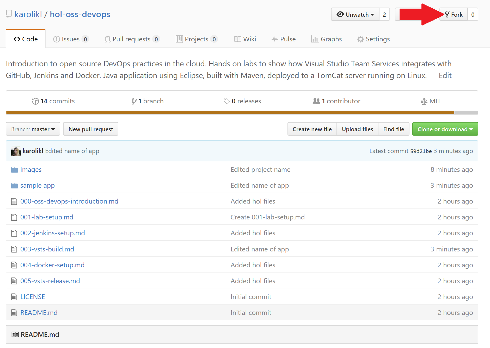

2. Create a new build definition by clicking "+ New definition"

3. Select the *Jenkins* template and click "Next"
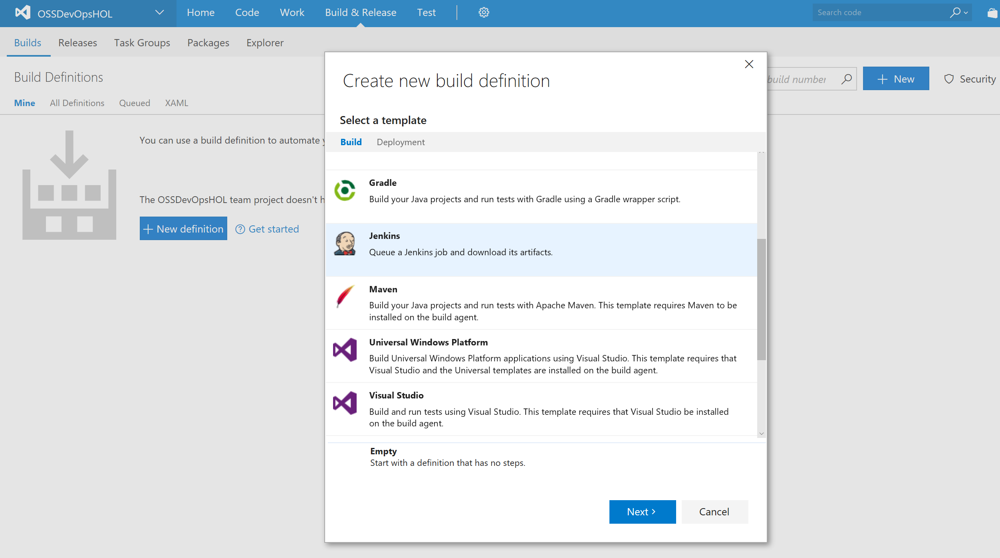

4. Select GitHub as the repository source and mark the "Continous Integration" checkbox. Keep all other settings as-is and click "Create".
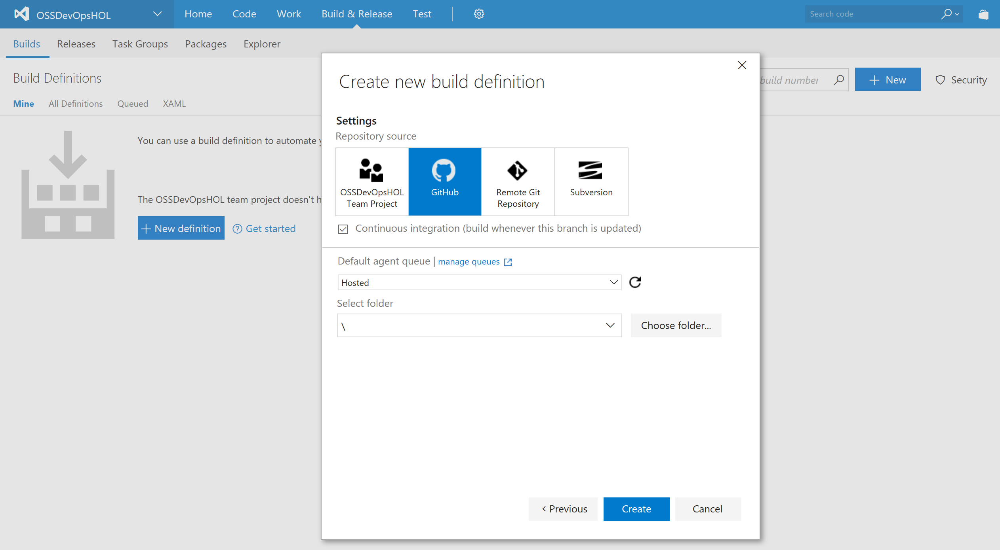

