# 4. Setting up Docker in Linux

## 4.1 Overview
In this lab we will configure a Docker machine to use it in our HOL-DEVOPS project.

### 4.1.1 Requirements
You must have completed all previous labs.

## 4.2 Setting up the Linux Machine in Azure

1. Browse to the [Azure Portal](https://portal.azure.com/) and search for *ubuntu* in the Marketplace. 
For this lab we will use the set up an Ubuntu Server:

    

2. Click Create to begin the creation of the VM and fill in the basic machine settings:  

    **Name:** OSSDevOpsHOLDocker  
    **VM Disk Type:** HDD  
    **Username:** ossdevopshol-user  
    **Authentication type:** Password  
    **Password:** Choose a password you will remember  
    **Subscription:** Your Azure subscription  
    **Resource group:** (Use existing) OSSDevOpsHOL  
    **Location:** Your preferred location
    

3. Select the "A1 Standard" virtual machine size. If you are unable to see this machine size, make sure you are viewing "All" machine sizes and not only those that are "Recommended" (you can toggle this view in the upper right corner of the machine size viewer). 


3. In the third step you can select optional extensions to be installed, but we will simply leave this as-is and select OK to move to the next step.


4. Validate the configuration settings you've selected and click OK. 


6. The machine will now be deployed for you: 


## 4.3 Generating public and private RSA keys

1. When the VM has been deployed, select the machine to open the overview window as shown below. 


2. Take note of the "Public IP address" of your machine, you will need this in the next step to access the machine.

3. Run PuTTY.exe and enter the public IP address from step 2 into the "Host name (or IP address) textbox" and click "Open" to connect to the machine. 
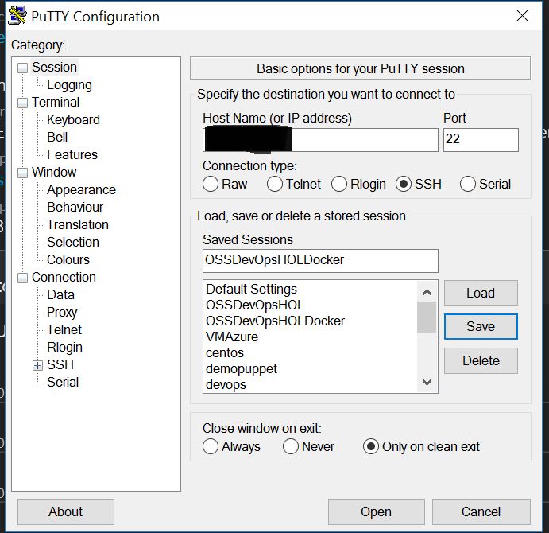

4. Specify the username and password that you defined earlier in this lab.
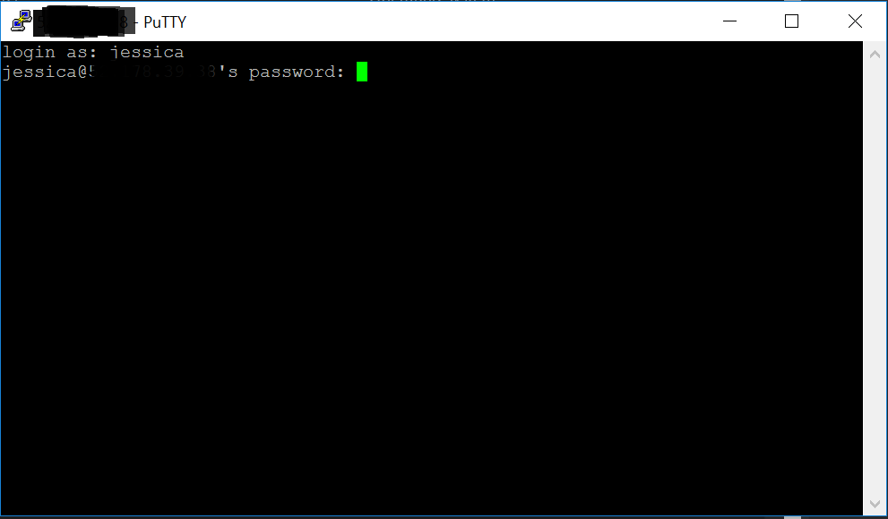

5. Generate a private key by specifying the following command: 
      ```
      openssl genrsa -aes256 -out ca-key.pem 4096
      ```
    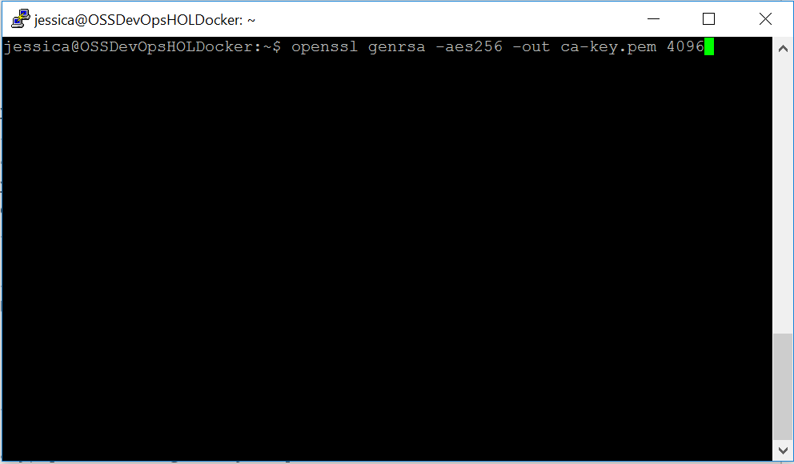

6. When prompted, supply a pass phrase for the private key:


7. Create public keys by running the following command:  
      ```
    openssl req -new -x509 -days 365 -key ca-key.pem -sha256 -out ca.pem
      ```
    Fill in your contact information when prompted. Specify *OSSDevOpsHOL* as the Common Name.
    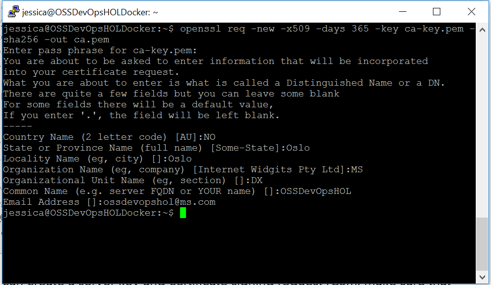

8. Create a server key by running the following command:  
      ```
    openssl genrsa -out server-key.pem 4096
      ```
    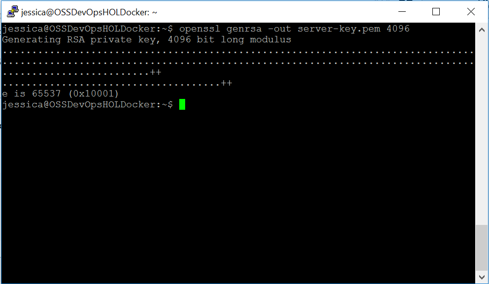

9. Create a CSR file: 
      ```
    openssl req -subj "/CN=OSSDevOpsHOLDocker" -sha256 -new -key server-key.pem -out server.csr
      ```
    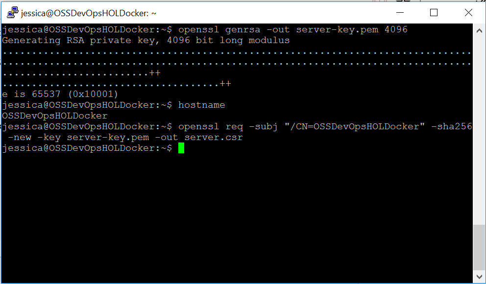

10. Allow connections using the specified IP-addresses: 
      ```
    echo subjectAltName = IP:10.10.10.20,IP:127.0.0.1 > extfile.cnf
      ```
    

11. Sign the public key:
      ```
    openssl x509 -req -days 365 -sha256 -in server.csr -CA ca.pem -CAkey ca-key.pem \
    -CAcreateserial -out server-cert.pem -extfile extfile.cnf
      ```
    

12. Create a client key
      ```
    openssl genrsa -out key.pem 4096
      ```
    

13. Create a client CSR 
    ```
    openssl req -subj '/CN=client' -new -key key.pem -out client.csr
      ```
    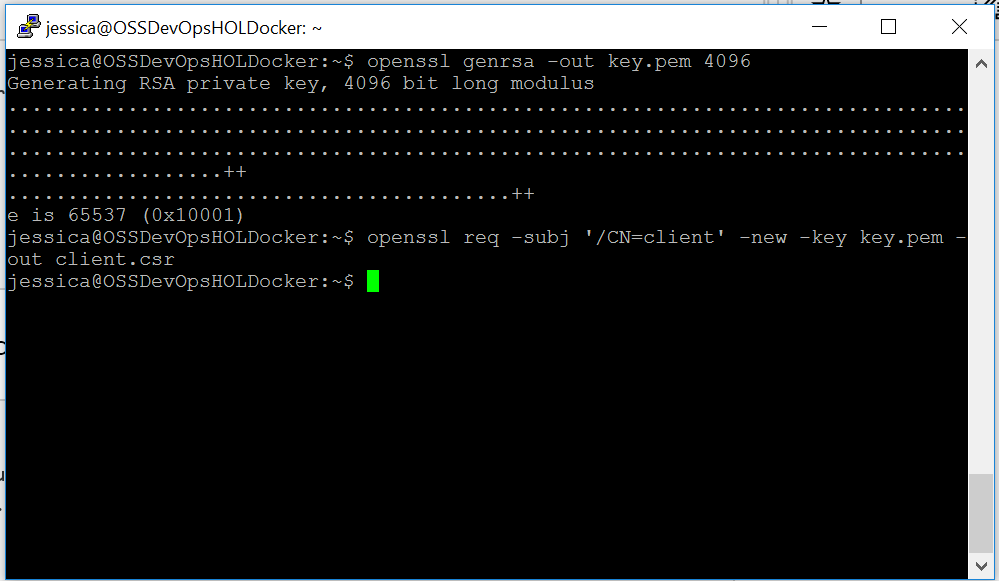

14. Create an extensions config file 
    ```
    echo extendedKeyUsage = clientAuth > extfile.cnf
      ```
    

15. Sign the public key
    ```
    openssl x509 -req -days 365 -sha256 -in client.csr -CA ca.pem -CAkey ca-key.pem \ 
    -CAcreateserial -out cert.pem -extfile extfile.cnf
      ```
    

16. Create Docker Certificates. Use base64 or another encoding tool to create base64-encoded topics.
    ```
    base64 ca.pem > ca64.pem
    base64 server-cert.pem > server-cert64.pem
    base64 server-key.pem > server-key64.pem
      ```

17. Run the following command: 
    ```
    ls
    ```
    You should now have all the keys listed below.
    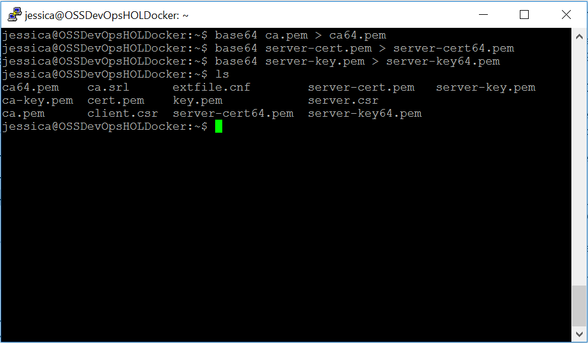

18. Store the contents of ca.pem, cert.pem and key.pem somewhere on your local machine by running the following commands and storing the keys. We will need these keys in Lab 05.
    ```
    less ca.pem
    less cert.pem
    less key.pem
    ```

## 4.4 Add a Docker extension

14. Browse to Azure portal and open the Docker machine created in step 4.2 in this Lab.

15. Go to Extensions -> Add -> Select Docker extension


16. Clicking on "Create" 


17. Provide the key's location and click on "OK". **Check step 13 in this Lab**


18. When the Docker extension deploy finish you will see the new Extension as is showing below


## 4.3 Setting up Docker communication endpoint

1. Browse to Azure portal and open the Docker machine created in step 4.2 in this Lab.
2. Go to Network interfaces -> Network security group -> Inbound security rules -> Add
Fill all the fields


3. When the rule has been deployed you will see it as is showing below


4. Verify the Docker environment variables

   **export DOCKER_HOST=tcp://yourhost:2376**

   **export DOCKER_TLS_VERIFY=1**

   **export DOCKER_CERT_PATH=/yourpath/.docker/**

5. Verifying the connection


## 4.5 Install .NET Core SDK for Linux

In order to run the VSTS Agent we need to make sure that .NET Core is installed in our Linux machine.

1. Add dotnet apt-get feed 

   **sudo sh -c 'echo "deb [arch=amd64] https://apt-mo.trafficmanager.net/repos/dotnet-release/ trusty main" > /etc/apt/sources.list.d/dotnetdev.list'**

   **sudo apt-key adv --keyserver apt-mo.trafficmanager.net --recv-keys 417A0893**


   **sudo apt-get update**


2. Install .NET Core SDK

   **sudo apt-get install dotnet-dev-1.0.0-preview2-003131**
   


## 4.6 Install VSTS Linux Agent
1. Browse to VSTS-> Agent queues -> Download agent


2. Browse to Get agent -> Linux -> your OS. For this Lab we will use **Ubuntu14.04-x64**
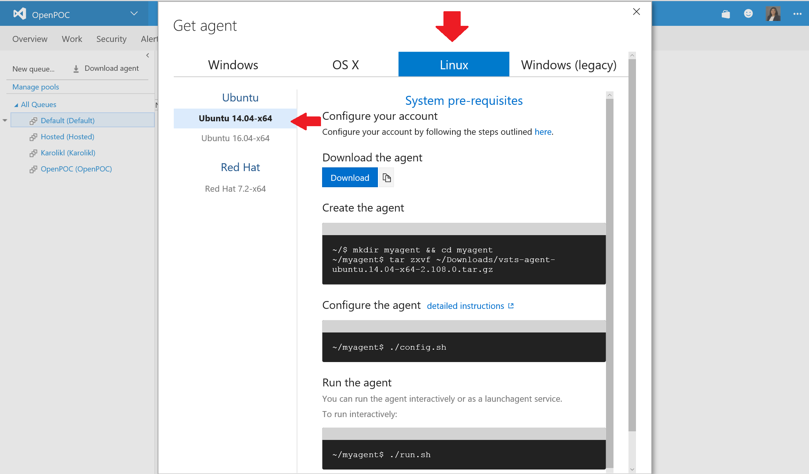

3. Dowload the agent and transfer to your Linux machine

4. Create the agent 

   ***$ mkdir myagent***

   ***$ cd myagent***

   ***$ tar zxvf /home/jessica/vsts-agent-ubuntu.14.04-x64-2.108.0.tar.gz***
    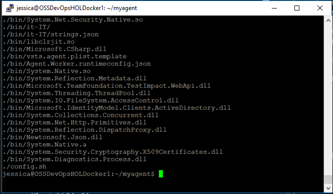

5. Configure the agent.
   
   Respond to the prompts:

   **Server URL: https://{your-account}.visualstudio.com**

   **Authentication type: Choose PAT, and then paste the PAT token you created in Lab1.**

    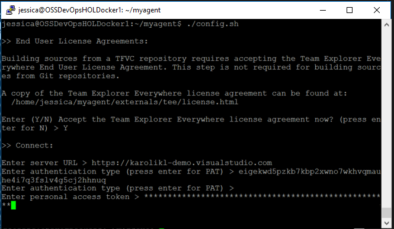 

   **Enter the agent pool(press Enter for default) > "your agent pool"**

   **Enter the agent name(press Enter for "your host name") > "your agent name"**
    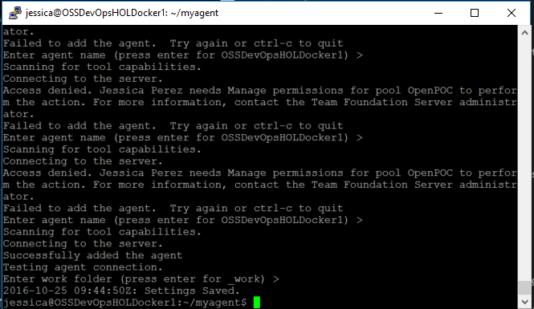

## 4.6 Create a directory for warfiles

During the release (**see Lab5**)  you will uploaded the war file to a directory in the Docker machine. In this section we just create a directory and named warfiles as is showing below.

