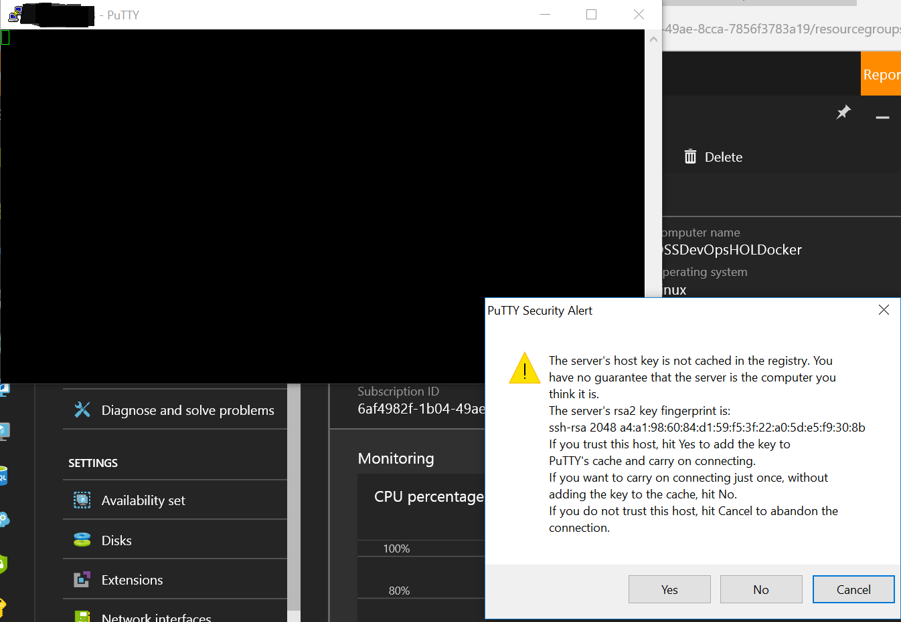
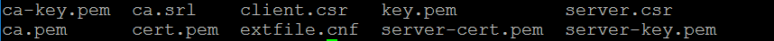

# 4. Setting up Docker in Linux

## 4.1 Overview
In this lab we will configure a Docker machine to use it in our HOL-DEVOPS project.

### 4.1.1 Requerimients
You must to have the Azure account mentioned in Lab 01.

## 4.2 Setting up the Linux Machine in Azure

1. Browse to Azure Portal

2. Create a new Linux Machine and fill all the requeriments

3. Select the machine size

3. Fill all the settings

4. Validate the configuration selected

6. Deploy the machine

## 4.2 Setting up Docker

1. Connect to the machine using Putty

2. Create the ssh keys

Make sure to use your own IPs

3. Browse to Azure portal and open the Docker machine created in step 4.2 in this Lab.

4. Go to Extensions -> Add -> Select Docker extension

5. Select create 

6. Load all the keys and select OK

7. When the deployment of the Docker extension finish you will see the new Extension as is showing below

## 4.3 Setting up Docker communication endpoint

1. Browse to Azure portal and open the Docker machine created in step 4.2 in this Lab.
2. Go to Network interfaces -> Network security group -> Inbound security rules -> Add
Fill all the fields

3. When the rule has been deployed you will see it as is showing below

4. Verify the Docker environment variables
    export DOCKER_HOST=tcp://yourhost:2376
    export DOCKER_TLS_VERIFY=1
    export DOCKER_CERT_PATH=/yourpath/.docker/

5. Verifying the connection

