# 4. Setting up Docker in Linux

## 4.1 Overview
In this lab we will configure a Docker machine to use it in our HOL-DEVOPS project.

### 4.1.1 Requerimients
You must to have the Azure account mentioned in Lab 01.

## 4.2 Setting up the Linux Machine in Azure

1. Browse to Azure Portal. For this lab we will use an Ubuntu template.

2. Create a new Linux Machine and specify all the details
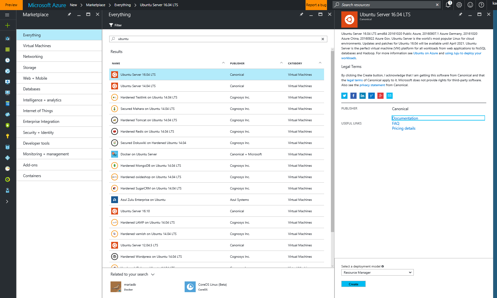

3. Select the machine size
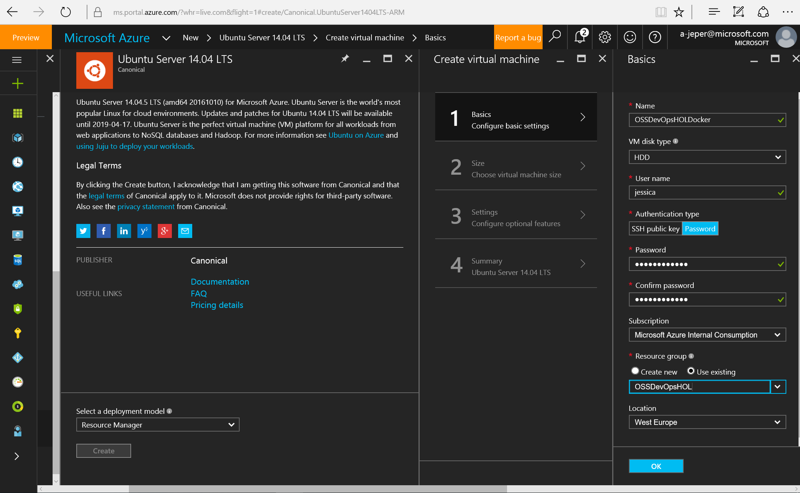

3. Specify all the settings 
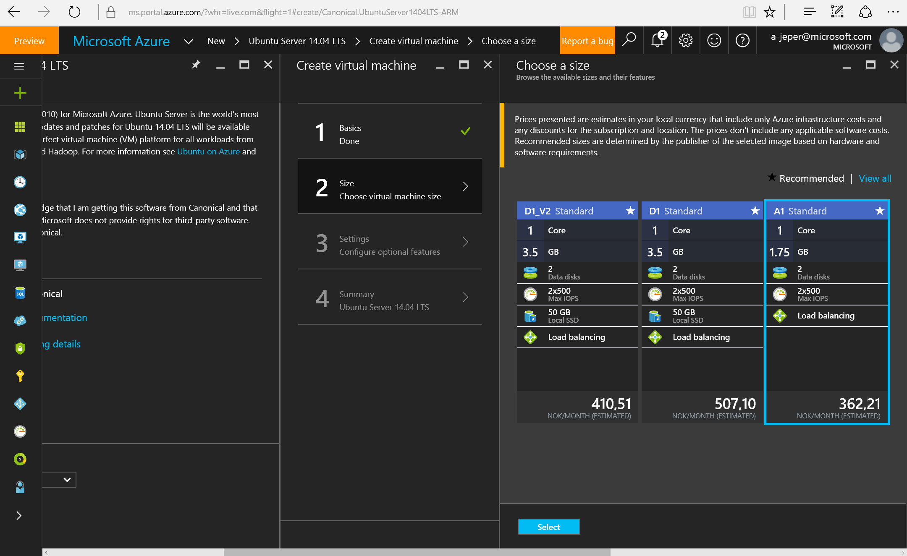

4. Validate the configuration selected
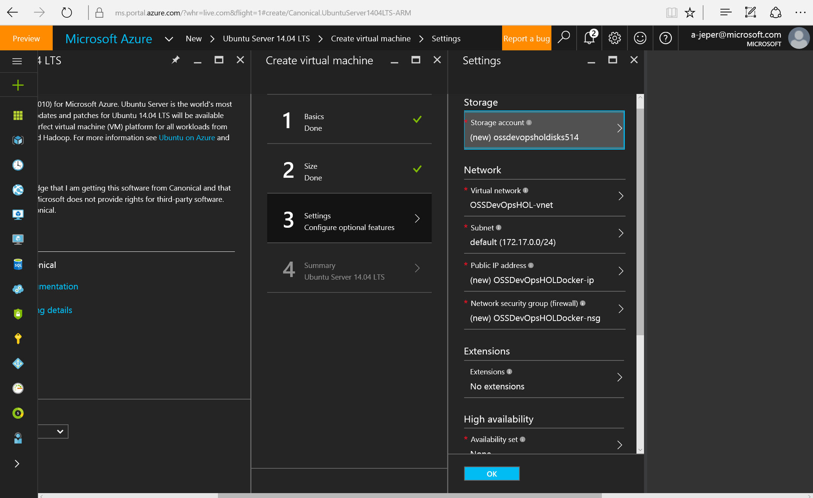

6. Deploy your machine by clicking on "OK"
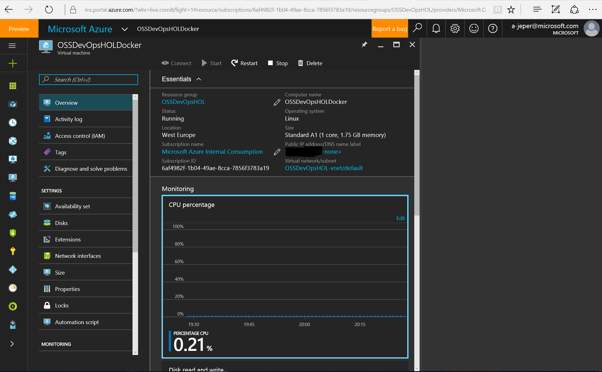

## 4.2 Setting up Docker

1. Once your machine is deployed; Connect to the machine, for this Lab we will use Putty as is showing below
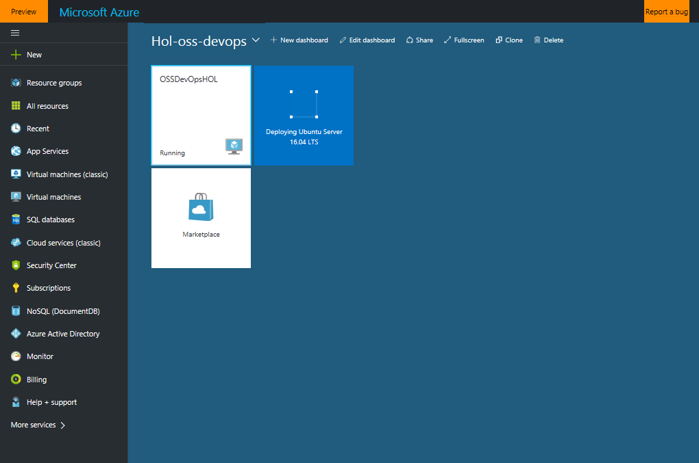

2. User and Password are the same that you defined in the step 2 of this Lab

3. Create a CA private "$ openssl genrsa -aes256 -out ca-key.pem 4096"

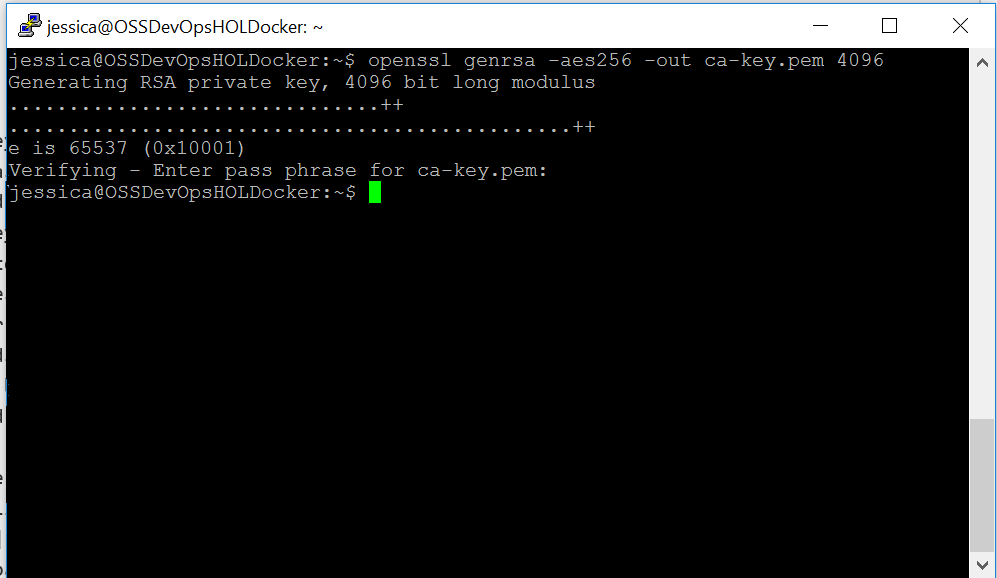

4. Create public keys "openssl req -new -x509 -days 365 -key ca-key.pem -sha256 -out ca.pem" **Do no forget specify your FQDN** 

5. Create a server key "$ openssl genrsa -out server-key.pem 4096" 

6. Create a CSR "openssl req -subj "/CN=$HOST" -sha256 -new -key server-key.pem -out server.csr" **Do no forget specify your HOST** 

7. Allow connections using IPs "$ echo subjectAltName = IP:10.10.10.20,IP:127.0.0.1 > extfile.cnf" **Make sure to use your own IPs**
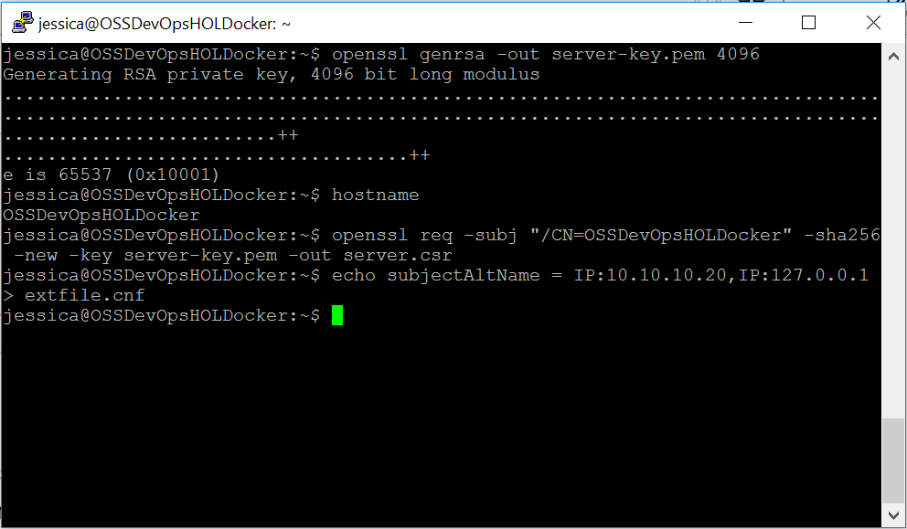

8. Sign the public key "openssl x509 -req -days 365 -sha256 -in server.csr -CA ca.pem -CAkey ca-key.pem \ -CAcreateserial -out server-cert.pem -extfile extfile.cnf"
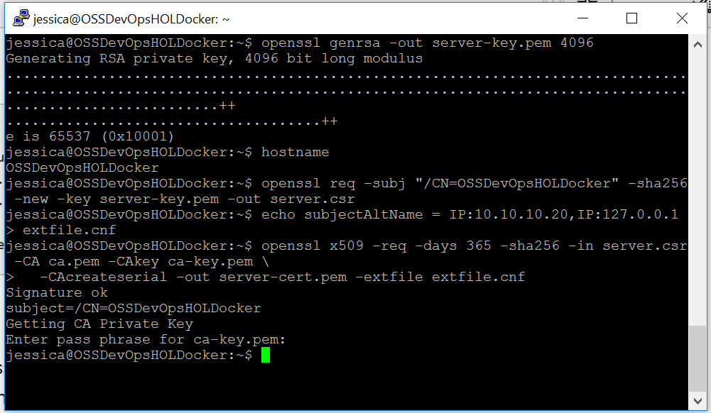

9. Create a client key "openssl genrsa -out key.pem 4096"
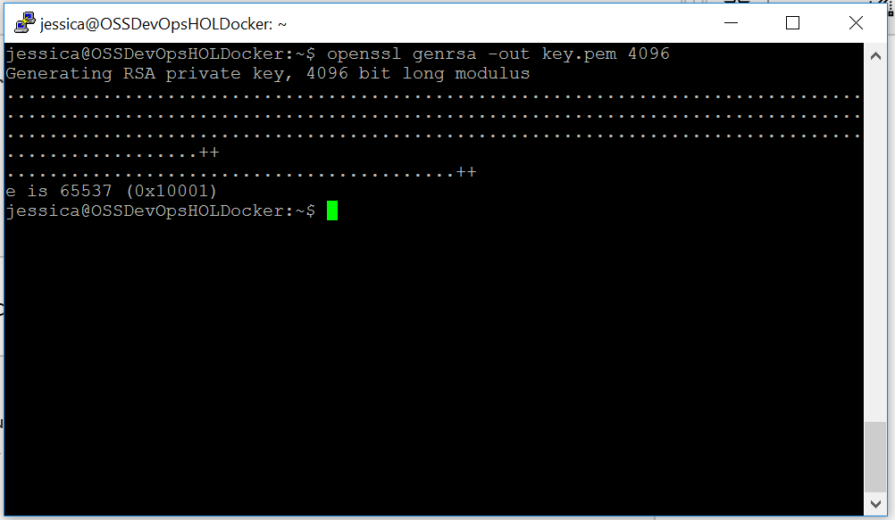

10. Create a CSR "openssl req -subj '/CN=client' -new -key key.pem -out client.csr"

11. Create an extensions config file "$ echo extendedKeyUsage = clientAuth > extfile.cnf"
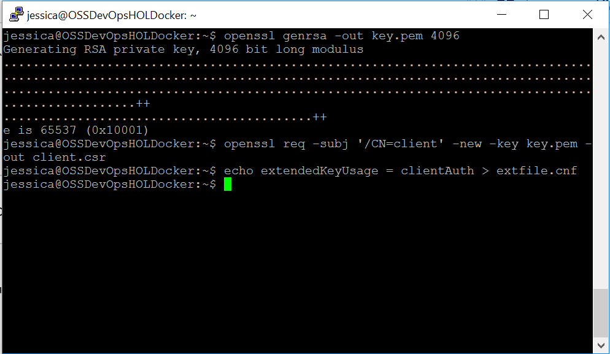

12. Sign the public key "$ openssl x509 -req -days 365 -sha256 -in client.csr -CA ca.pem -CAkey ca-key.pem \ -CAcreateserial -out cert.pem -extfile extfile.cnf
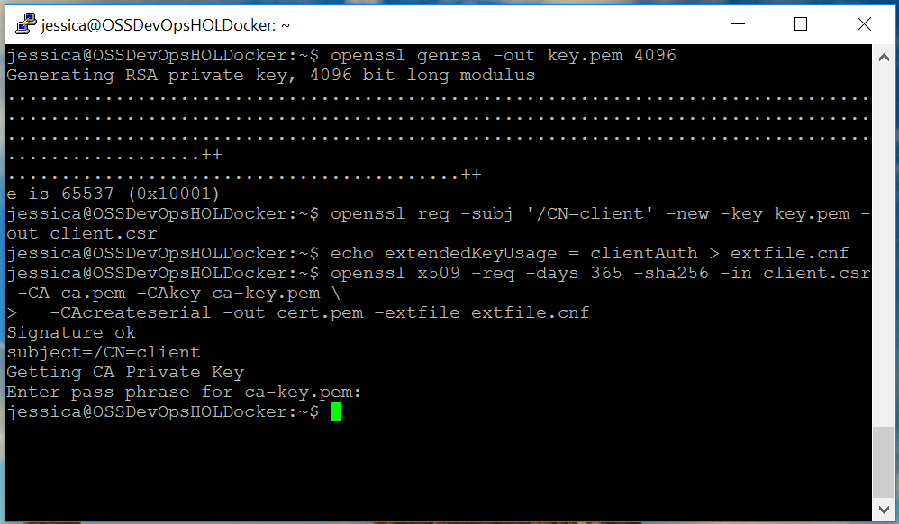

13. Create Docker Certificates. Use base64 or another encoding tool to create base64-encoded topics

     ***~/.docker$ base64 ca.pem > ca64.pem***

     ***~/.docker$ base64 server-cert.pem > server-cert64.pem***

     ***~/.docker$ base64 server-key.pem > server-key64.pem***

13. At the end you should have all those keys listed below. **Store your keys, we will use it in step 17 in to this Lab**

14. Browse to Azure portal and open the Docker machine created in step 4.2 in this Lab.

15. Go to Extensions -> Add -> Select Docker extension
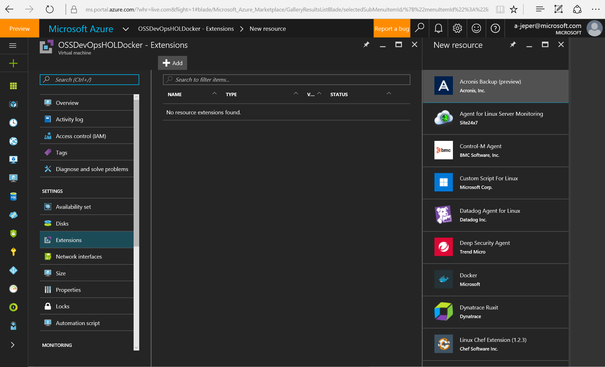

16. Clicking on "Create" 
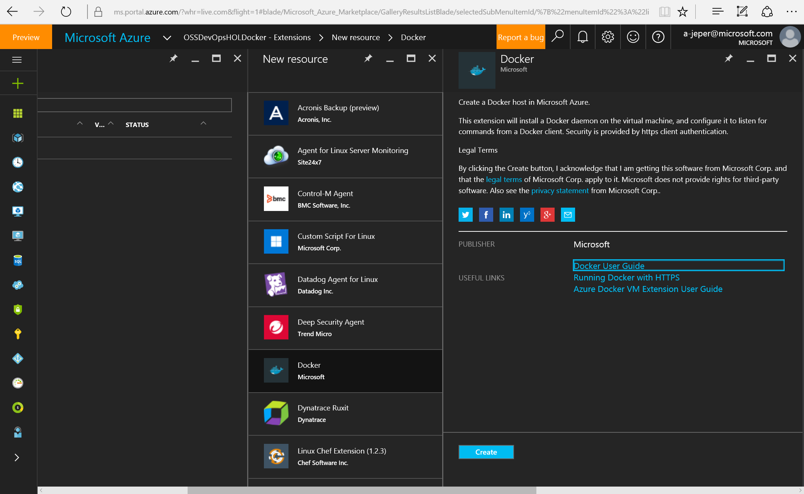

17. Provide the key's location and click on "OK". **Check step 13 in this Lab**

18. When the Docker extension deploy finish you will see the new Extension as is showing below

## 4.3 Setting up Docker communication endpoint

1. Browse to Azure portal and open the Docker machine created in step 4.2 in this Lab.
2. Go to Network interfaces -> Network security group -> Inbound security rules -> Add
Fill all the fields
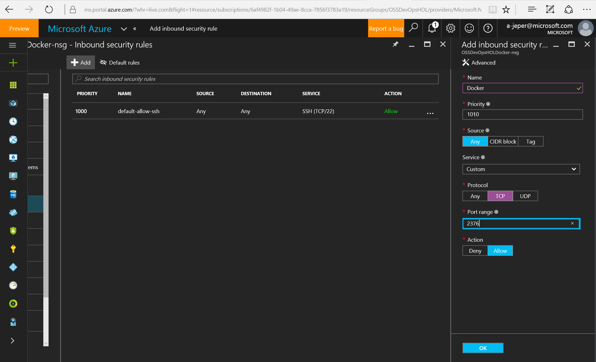

3. When the rule has been deployed you will see it as is showing below

4. Verify the Docker environment variables

   **export DOCKER_HOST=tcp://yourhost:2376**

   **export DOCKER_TLS_VERIFY=1**

   **export DOCKER_CERT_PATH=/yourpath/.docker/**

5. Verifying the connection
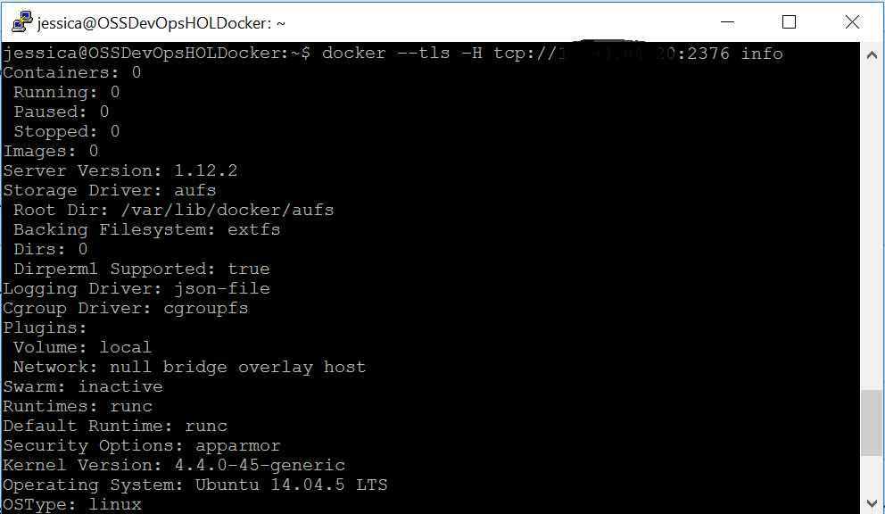

