# 5. Release management in Visual Studio Team Services
## 5.1. Overview
In this lab, we will configure release management for our sample application. We will create a Docker Registry service endpoint that enables us to pull a TomCat image from Docker Hub and run it to create a container. We will retrieve the artifact created by our automated build in Lab 3, and using the VSTS build agent created in Lab 4, we will run a docker command to deploy the artifact to the TomCat container running on a Linux machine in Azure.

### 5.1.2 Requirements
You must have completed all previous labs.

## 5.2. Connecting VSTS to Docker Hub and a Docker Host

1. Register for a Docker ID by creating an account on Docker Hub as explained [in the Docker documentation](https://docs.docker.com/docker-hub/accounts/).

2. Navigate to "Services" under "Settings"
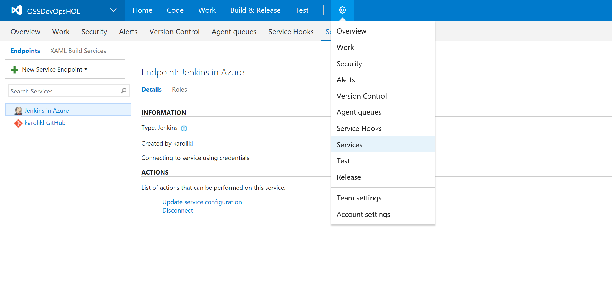

3. Create a new Docker Registry connection by clicking on "+ New Service Endpoint" and selecting "Docker Registry"
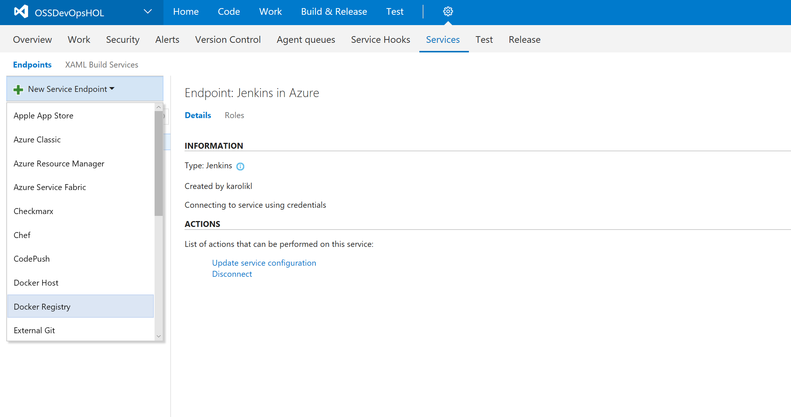

4. Specify the following information for your connection and click OK:   

    **Connection name**: Docker Hub  
    **Docker registry**: https://index.docker.io/v1/  
    **Docker ID**: The Docker ID you created in step 1  
    **Password**: Your Docker Hub Password  
    **Email**: Optional

    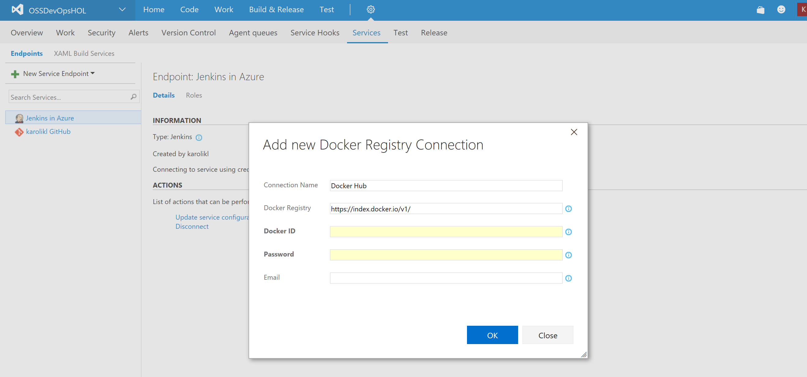

5. You should now see the service endpoint you just created in the overview:
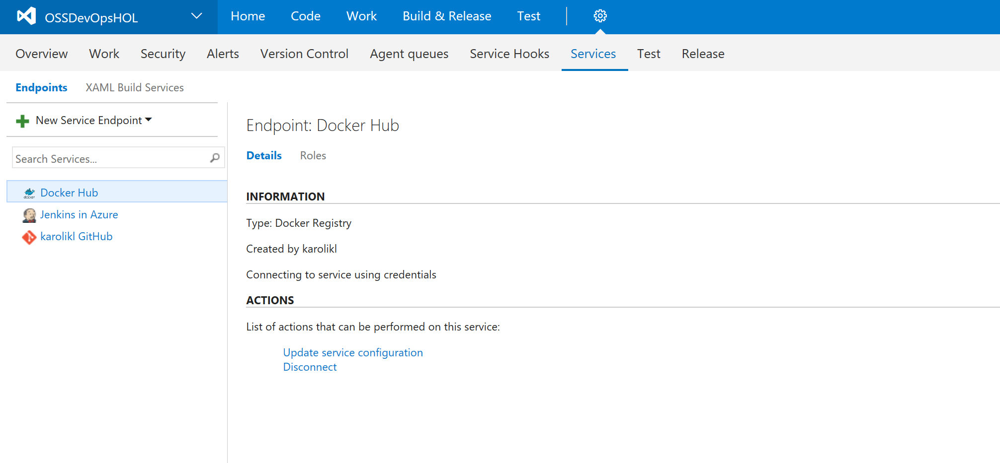 

6. Create a new Docker Host connection by clicking on "+ New Service Endpoint" and selecting "Docker Host"
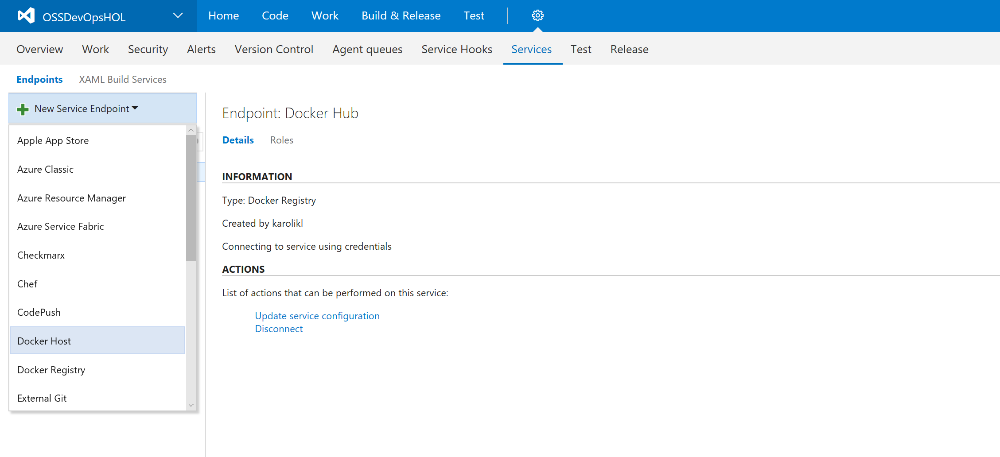 

5. Specify the following information for your connection and click OK:   

    **Connection Name**: Docker Host  
    **Server URL**: Specify the server URL of the Docker Machine you created in LABX
    **CA Certificate**: Paste in the CA certificate you saved to disk in LABX
    **Certificate**: Paste in the certificate you saved to disk in LABX
    **Key**: Paste in the key you saved to disk in LABX

     

6. You should now see the service endpoint you just created in the overview:
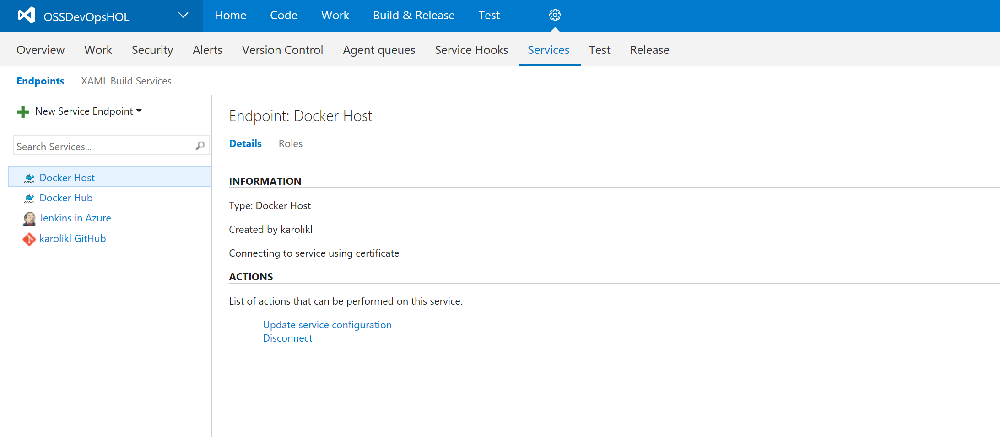  

## 5.3 Creating a Release Definition in VSTS

We will now create a new *Release Definition* that contains all the steps to be executed when we deploy a release. We will enable [*Continous Deployment*](https://en.wikipedia.org/wiki/Continuous_delivery) so that a new release is created every time a build is successful.

1. Go to "Releases" under "Build & Release"
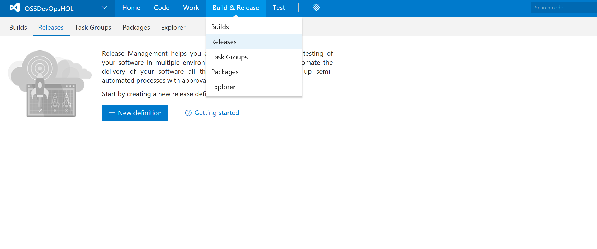

2. Create a new release definition by clicking "+ New definition"

3. This time we will not base our release definition on a template, therefore you select "Empty" and click "Next"
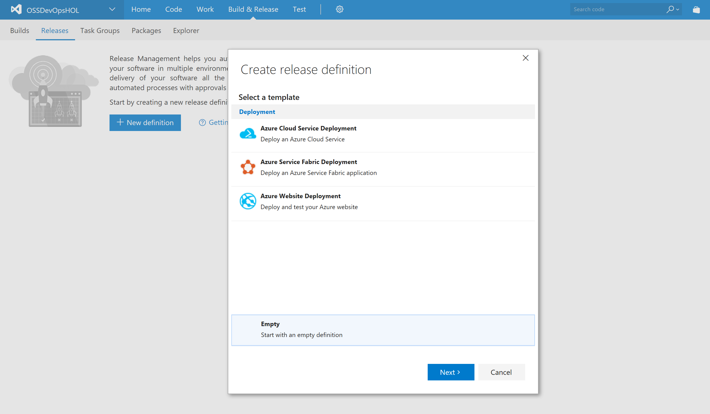

4. Select "Build" as the artifact source and fill out the fields as specified below and click "Create":  
    
    **Source (Build definition):** Point to the build we created in Lab 03  
    **Continous deployment:** Check  
    **Queue:** Select the queue containing the VSTS agent we installed in Lab 04.

    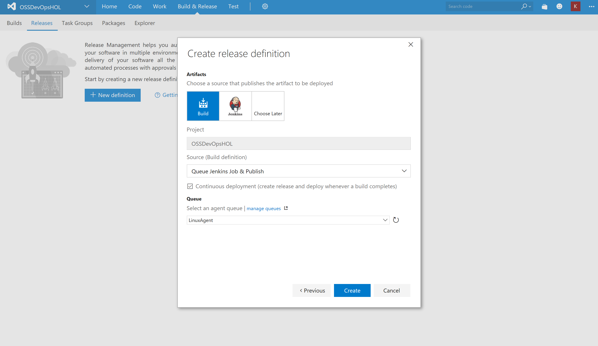 

5. You should now see a default release definition that is empty. 
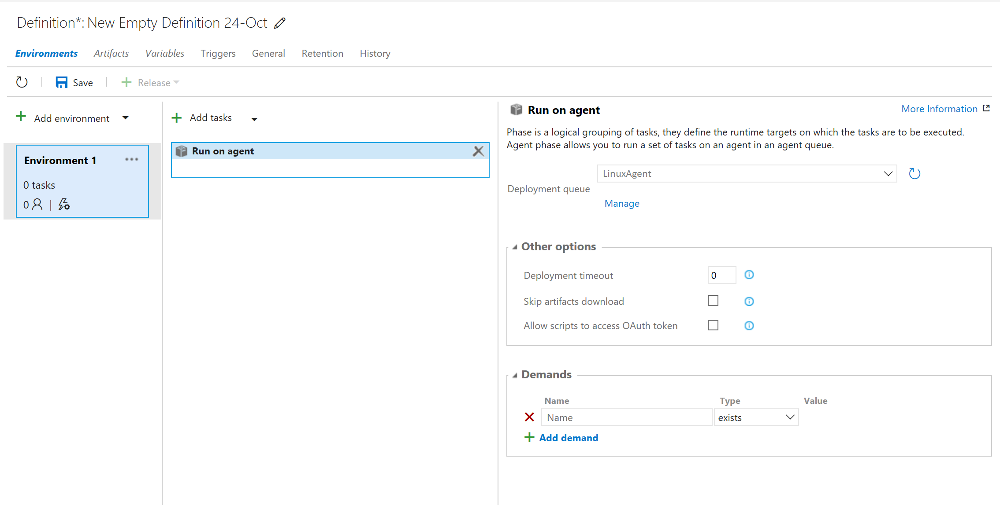

6. Give your release definition a new name:
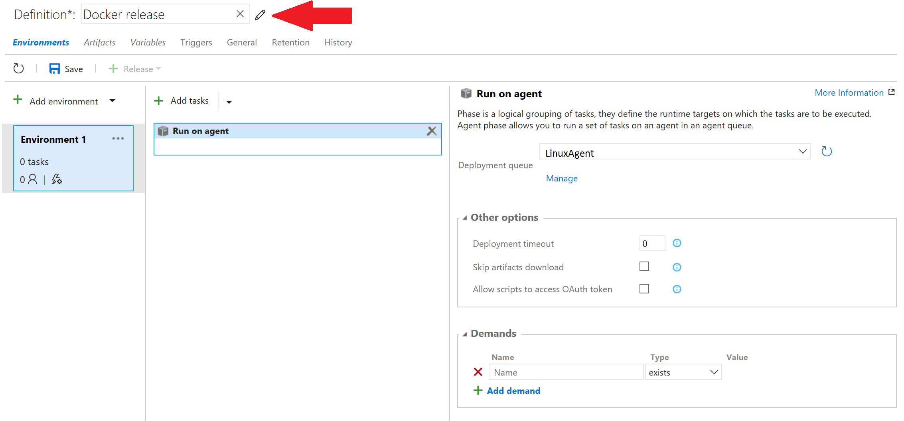

7. Rename "Environment 1" to "Staging":
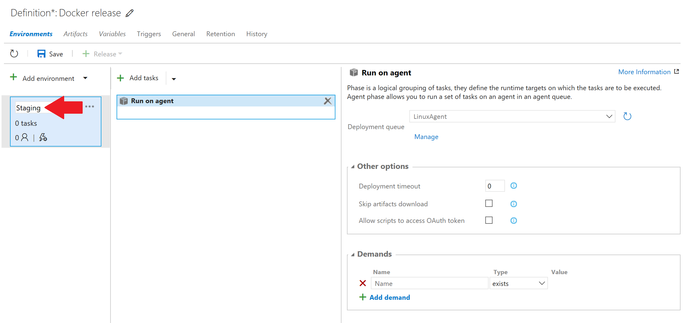

7. Save your release definition and click "OK".
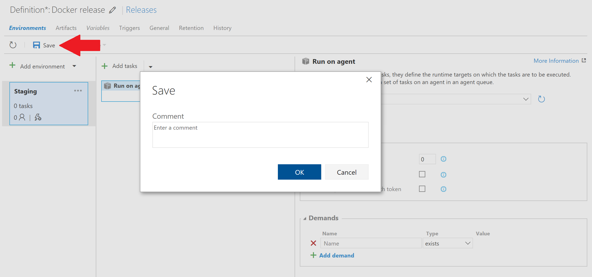

## 5.4 Installing the VSTS Docker extension

1. Browse to the [Docker Integration](https://marketplace.visualstudio.com/items?itemName=ms-vscs-rm.docker) extension on the Visual Studio marketplace.

2. Install the extension by clicking "Install" and selecting the account you want to install the extension for. 

## 5.5 Configure release steps

We will now configure the release tasks for the Staging environment of our release definition.

1. Go to "Releases" under "Build & Release" and select the release definition you created earlier. 

2. Click "+ Add task"
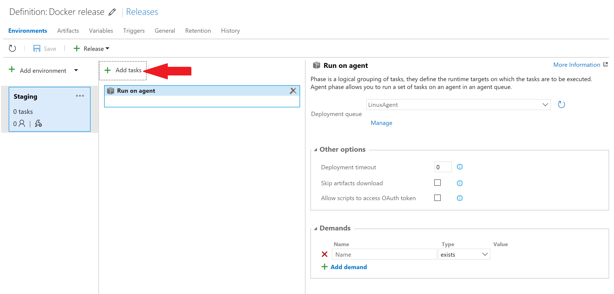

3. Select "All" in the menu to show all the tasks that are available. Find the task called "Docker" and click "Add" twice to add two Docker tasks. 
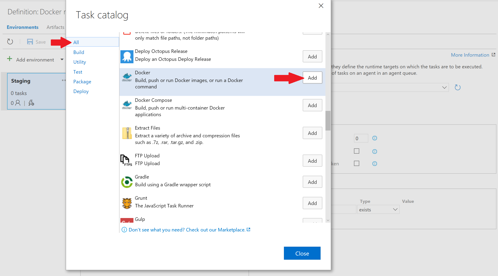

4. When you close the pop-up, your release definition should look like this: 
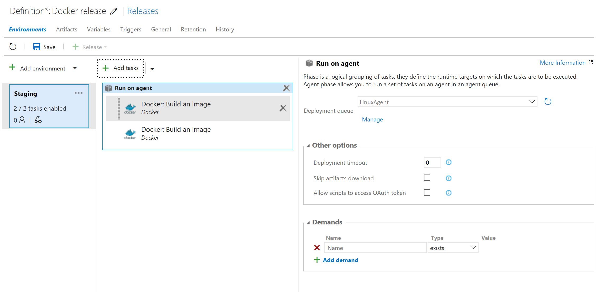 

5. Select the first "Docker" task and edit it to match the following fields:

    **Docker Registry Connection:** Select your Docker Registry endpoint  
    **Action:** Run an image  
    **Image Name:** tomcat:8.0  
    **Container Name:** ossdevops-v$(Release.ReleaseId)-staging  
    **Ports:** 8888:8080  
    **Run in Background:** Checked  
    
    **Advanced options**  
    **Docker Host Connection:** Select your Docker Host endpoint   
    **Working Directory**: $(System.DefaultWorkingDirectory)  
    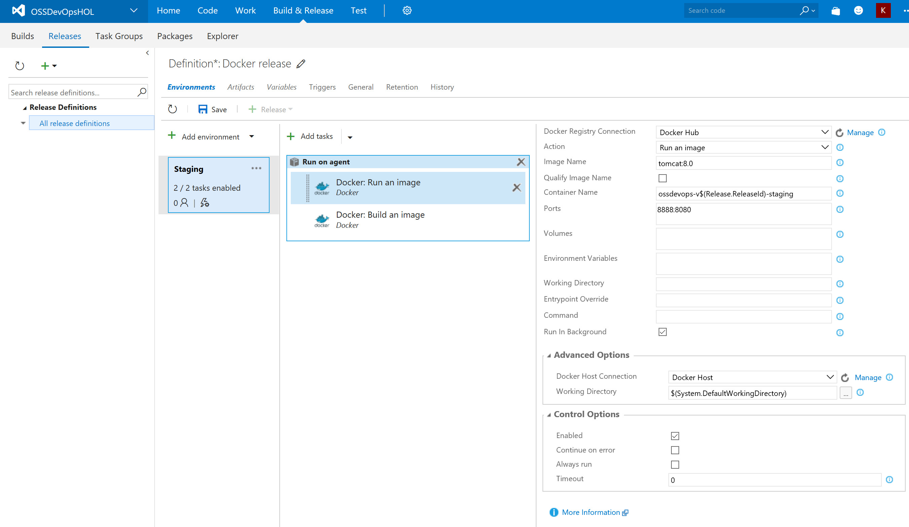  

    Note that we name our container using a variable: $(Release.ReleaseId). This is a built-in variable that will insert the ID of the release into the name of the container being created in this task.

6. Select the second "Docker" task and edit it to match the following fields:

    **Docker Registry Connection:** Select your Docker Registry endpoint  
    **Action:** Run an image  
    **Image Name:** tomcat:8.0  
    **Container Name:** ossdevops-v$(Release.ReleaseId)-staging  
    **Ports:** 8888:8080  
    **Run in Background:** Checked  
    
    **Advanced options**  
    **Docker Host Connection:** Select your Docker Host endpoint   
    **Working Directory**: $(System.DefaultWorkingDirectory)  
      

    Note that we name our container using a variable: $(Release.ReleaseId). This is a built-in variable that will insert the ID of the release into the name of the container being created in this task.

